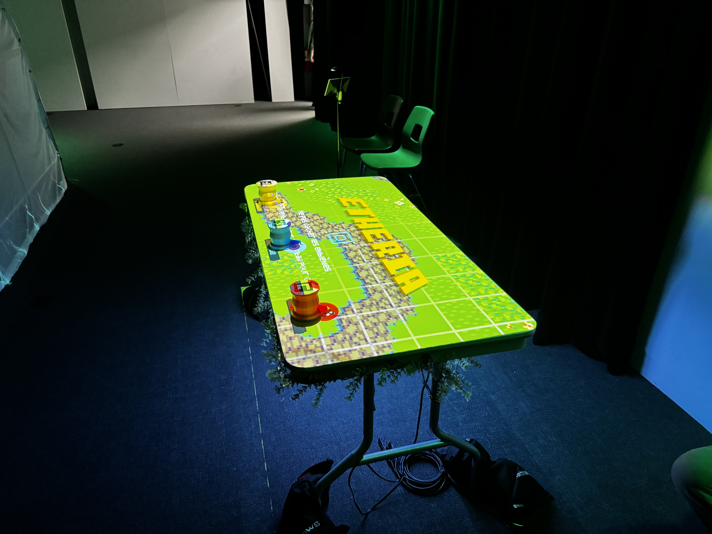
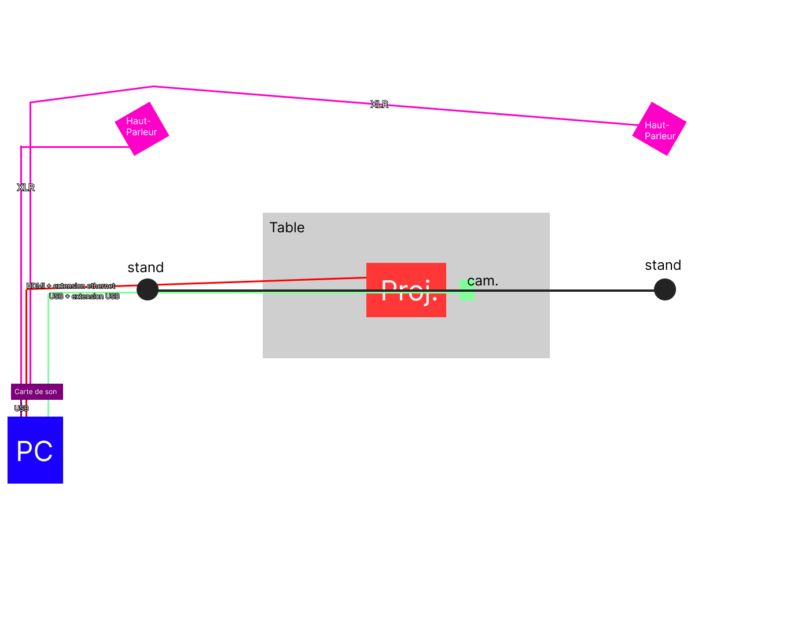
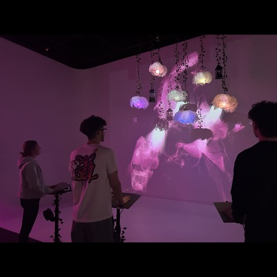
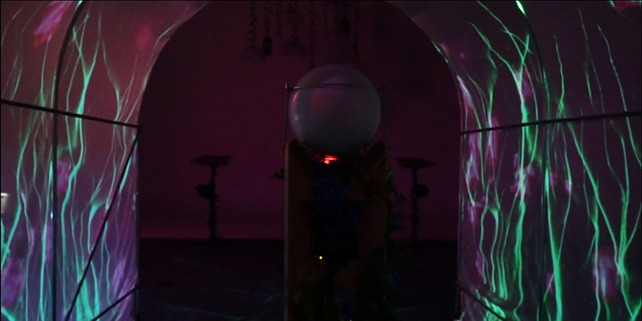
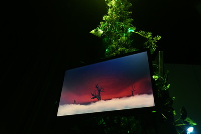
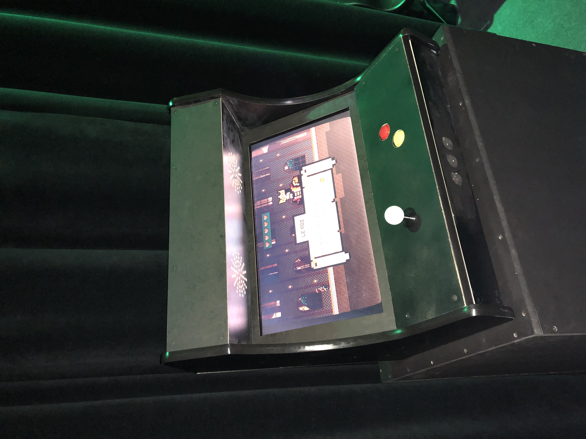

# Fiche Groupée des Projets Finissants en TIM

Cette fiche regroupe l'ensemble des projets (autres que mon projet préféré Etheria), en indiquant pour chacun :
- Le nom du projet et les créateurs/créatrices
- L'installation en cours (ou finale) dans les studios (photos à l'appui)
- Le schéma de l'installation prévue, avec la source extraite de leur documentation GitHub
- Mon ressenti avant et après expérimentation, avec justification

De plus, trois cours essentiels sont identifiés pour acquérir les compétences nécessaires à la création de tels projets.

---

## Etheria
[Etheria GitHub](https://ethereal-creators.github.io/Etheria/#/)

- Installation finale dans les studios  
    
  *Source : Etheria GitHub (https://ethereal-creators.github.io/Etheria/#/)*
- Schéma de l'installation prévue  
    
  *Source : Etheria GitHub (https://ethereal-creators.github.io/Etheria/#/)*

*Ressenti et Justification* :  
- Avant l'expérimentation : J’attendais une expérience immersive alliant art et technologie.  
- Après l'expérimentation : J'ai vraiment apprécié les jeux proposés, et l'expérience s'est avérée amusante et facile d'utilisation, transformant chaque mouvement en un défi interactif motivant.

---

## Luminatura
[Luminatura GitHub](https://miaou-mafia.github.io/projet-luminatura/#/)

- Installation finale dans les studios  
    
  *Source : Luminatura GitHub (https://miaou-mafia.github.io/projet-luminatura/#/)*
- Schéma de l'installation prévue  
    
  *Source : Luminatura GitHub (https://miaou-mafia.github.io/projet-luminatura/#/)*

*Ressenti et Justification* :  
- Avant l'expérimentation : J'attendais une immersion visuelle marquante et innovante.  
- Après l'expérimentation : L'installation offre une expérience immersive subtile et engageante, avec une scénographie soignée qui joue avec les transitions de couleurs et crée une ambiance lumineuse stimulante.

---

## Internature
[Internature GitHub](https://tprangers.github.io/internature/)

- Installation finale dans les studios  
    
  *Source : Internature GitHub (https://tprangers.github.io/internature/)*
- Schéma de l'installation prévue  
    
  *Source : Internature GitHub (https://tprangers.github.io/internature/)*

*Ressenti et Justification* :  
- Avant l'expérimentation : J'étais curieux(se) de découvrir comment des éléments naturels pouvaient être intégrés à une installation interactive.  
- Après l'expérimentation : L'installation crée un équilibre harmonieux entre nature et technologie, et les bruits authentiques de la nature nous mettaient vraiment dans l'ambiance, renforçant l'expérience immersive.

---

## Prismatica
[Prismatica GitHub](https://pootpookies.github.io/Prismatica/)

- Installation finale dans les studios  
    
  *Source : Prismatica GitHub (https://pootpookies.github.io/Prismatica/)*
- Schéma de l'installation prévue  
    
  *Source : Prismatica GitHub (https://pootpookies.github.io/Prismatica/)*

*Ressenti et Justification* :  
- Avant l'expérimentation : J'espérais une approche visuelle audacieuse et interactive.  
- Après l'expérimentation : L'interactivité et l'esthétique se démarquent, bien que l'intégration globale semble moins aboutie comparativement aux autres projets.

---

## Fuga
[Fuga GitHub](https://escapism-fuga.github.io/Fuga/#/)

- Installation finale dans les studios  
    
  *Source : Fuga GitHub (https://escapism-fuga.github.io/Fuga/#/)*
- Schéma de l'installation prévue  
    
  *Source : Fuga GitHub (https://escapism-fuga.github.io/Fuga/#/)*

*Ressenti et Justification* :  
- Avant l'expérimentation : J'étais intéressé(e) par la manière dont l'interactivité pouvait transformer l'expérience sensorielle dans un contexte de nature.
- Après l'expérimentation : Les sons authentiques de la nature diffusés dans l'installation nous plongeaient vraiment dans l'ambiance, créant un équilibre harmonieux entre nature et technologie, et renforçant l'expérience immersive.

## Arcadia
[Arcadia GitHub](https://cousi-cousa.github.io/Arcadia/#/)

- Installation finale dans les studios  
    
  *Source : Arcadia GitHub (https://cousi-cousa.github.io/Arcadia/#/)*
- Schéma de l'installation prévue  
    
  *Source : Arcadia GitHub (https://cousi-cousa.github.io/Arcadia/#/)*

*Ressenti et Justification* :  
- Avant l'expérimentation : J'étais curieux(se) de voir comment l'esthétique et la technologie se fusionneraient.  
- Après l'expérimentation : L'installation se distingue par sa scénographie soignée et une atmosphère singulière, bien que l'interactivité y soit moins prononcée.

---

## Cours Incontournables pour la Réalisation de Projets Multimédia Interactifs
Pour développer les compétences nécessaires, je recommande les cours suivants :
1. **H420 V11 MO Programmation interactive**  
   *Indispensable pour maîtriser les interactions en temps réel.*
2. **H582412 MO Traitement audiovisuel**  
   *Essentiel pour intégrer efficacement les aspects visuels et sonores des installations.*
3. **A 582501 MO Conception d'une expérience multimédia**  
   *Crucial pour concevoir et gérer globalement un projet interactif.*

---

*Cette fiche a été réalisée en respectant les consignes et*
