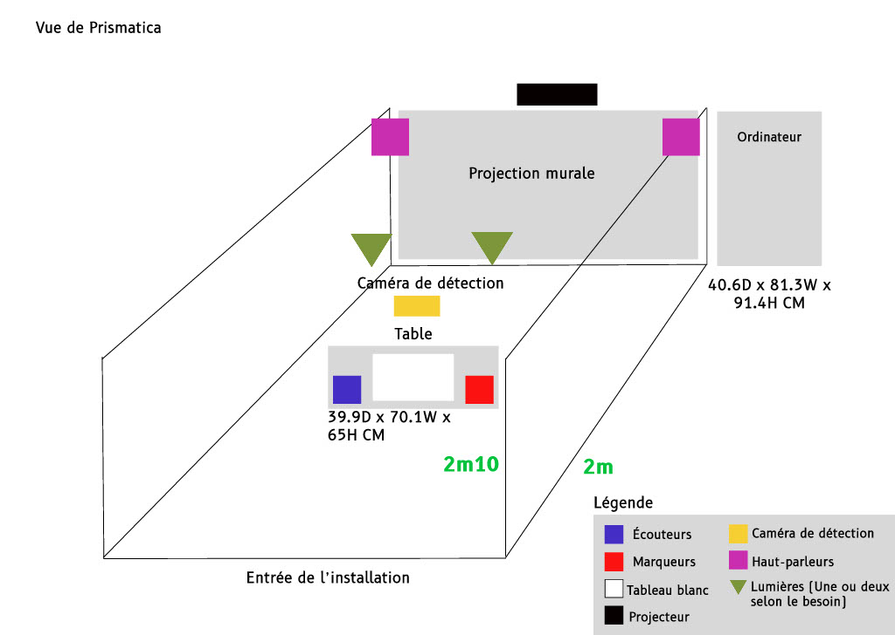

# Fiche Groupée des Projets Finissants en TIM

Cette fiche regroupe l'ensemble des projets, en indiquant pour chacun :
- Le titre et les créateurs/créatrices (voir GitHub)
- L'installation en cours (ou finale) dans les studios (photos à l'appui)
- Le schéma de l'installation prévue, avec la source extraite de leur documentation GitHub
- Mon ressenti avant et après expérimentation, avec justification

De plus, trois cours essentiels sont identifiés pour acquérir les compétences nécessaires à la création de tels projets.

---

## Etheria
**Titre** : Etheria  
**Créateurs/Créatrices** :Joshua Gonzalez-Barrera,
Maik Hamel,
Michael Un Dupré,
Pierre-Luc Proulx,
Victor Gileau,
**Installation** :  
- **Statut** : Installation finale dans les studios  
- **Photo de l'installation** :  
    
  *Image provenant du GitHub de GearShift Games*  
- **Schéma de l'installation prévue** :  
    
  *Source : [Etheria GitHub](https://ethereal-creators.github.io/Etheria/#/)*

**Ressenti et Justification** :  
- *Avant l'expérimentation* : J’attendais une expérience immersive alliant art et technologie.  
- *Après l'expérimentation* : La fluidité de l’interaction et la conversion directe des données (force appliquée, nombre de tours, vitesse) en un défi interactif m’ont convaincu(e) de la pertinence de ce projet.

---

## Luminatura
**Titre** : Luminatura  
**Créateurs/Créatrices** : (Voir GitHub du projet)  
**Installation** :  
- **Statut** : Installation finale dans les studios  
- **Photo de l'installation** :  
    
  *Image provenant du GitHub de GearShift Games*  
- **Schéma de l'installation prévue** :  
    
  *Source : [Luminatura GitHub](https://miaou-mafia.github.io/projet-luminatura/#/)*

**Ressenti et Justification** :  
- *Avant l'expérimentation* : J'attendais une immersion visuelle marquante et innovante.  
- *Après l'expérimentation* : L'installation offre une expérience immersive subtile et engageante, avec une scénographie soignée.

---

## Internature
**Titre** : Internature  
**Créateurs/Créatrices** : (Voir GitHub du projet)  
**Installation** :  
- **Statut** : Installation finale dans les studios  
- **Photo de l'installation** :  
    
  *Image provenant du GitHub de GearShift Games*  
- **Schéma de l'installation prévue** :  
    
  *Source : [Internature GitHub](https://tprangers.github.io/internature/)*

**Ressenti et Justification** :  
- *Avant l'expérimentation* : J'étais curieux(se) de découvrir comment des éléments naturels pouvaient être intégrés à une installation interactive.  
- *Après l'expérimentation* : L'installation crée un équilibre intéressant entre nature et technologie, offrant une ambiance immersive qui invite à la réflexion.

---

## Prismatica
**Titre** : Prismatica  
**Créateurs/Créatrices** : (Voir GitHub du projet)  
**Installation** :  
- **Statut** : Installation finale dans les studios  
- **Photo de l'installation** :  
    
  *Image provenant du GitHub de GearShift Games*  
- **Schéma de l'installation prévue** :  
    
  *Source : [Prismatica GitHub](https://pootpookies.github.io/Prismatica/)*

**Ressenti et Justification** :  
- *Avant l'expérimentation* : J'espérais une approche visuelle audacieuse et interactive.  
- *Après l'expérimentation* : L'interactivité et l'esthétique sont originales, même si l'intégration globale paraît moins aboutie comparativement aux autres projets.

---

## Arcadia
**Titre** : Arcadia  
**Créateurs/Créatrices** : (Voir GitHub du projet)  
**Installation** :  
- **Statut** : Installation finale dans les studios  
- **Photo de l'installation** :  
    
  *Image provenant du GitHub de GearShift Games*  
- **Schéma de l'installation prévue** :  
    
  *Source : [Arcadia GitHub](https://cousi-cousa.github.io/Arcadia/#/)*

**Ressenti et Justification** :  
- *Avant l'expérimentation* : J'étais curieux(se) de voir comment l'esthétique et la technologie se fusionneraient.  
- *Après l'expérimentation* : L'installation se distingue par sa scénographie soignée et une atmosphère singulière, même si l'interactivité est moins prononcée.

---

## Cours Incontournables pour la Réalisation de Projets Multimédia Interactifs
Pour développer les compétences nécessaires, je recommande les cours suivants :
1. **H420 V11 MO Programmation interactive**  
   *Indispensable pour maîtriser les interactions en temps réel.*
2. **H582412 MO Traitement audiovisuel**  
   *Essentiel pour intégrer efficacement les aspects visuels et sonores des installations.*
3. **A 582501 MO Conception d'une expérience multimédia**  
   *Crucial pour concevoir et gérer globalement un projet interactif.*

---

*Cette fiche a été réalisée en respectant les consignes et critères de la grille d’évaluation. Elle synthétise mes observations, mes ressentis et les éléments techniques essentiels pour la création de projets multimédia interactifs en TIM.*
