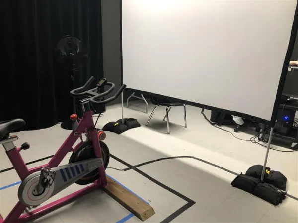
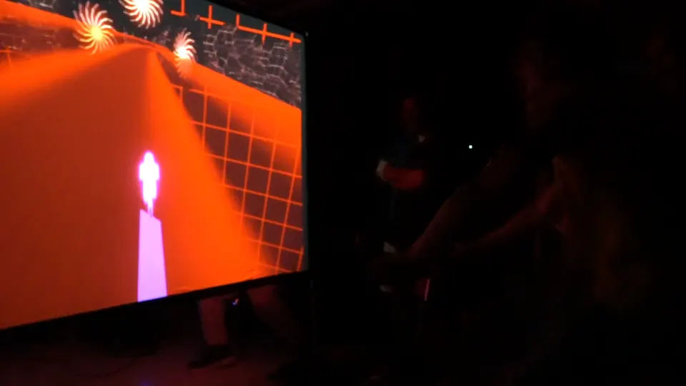
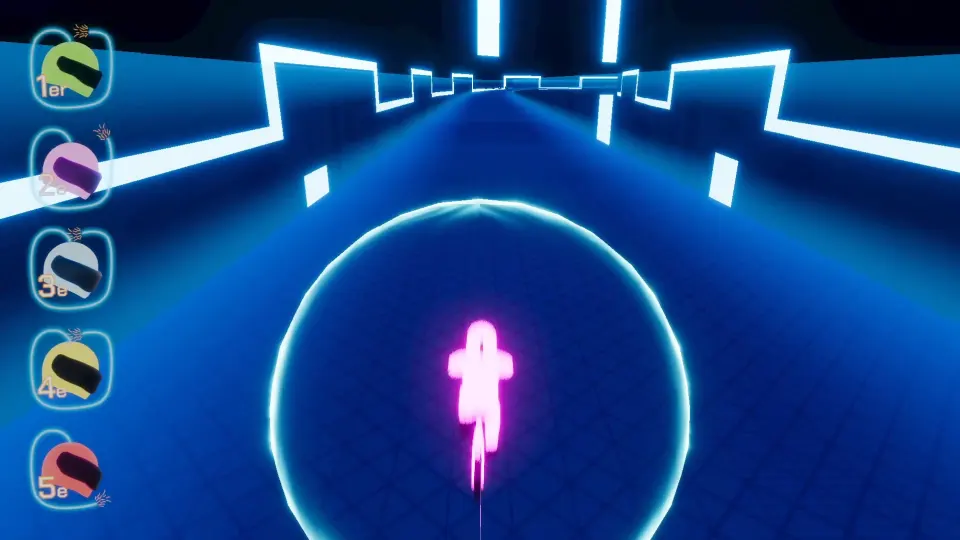
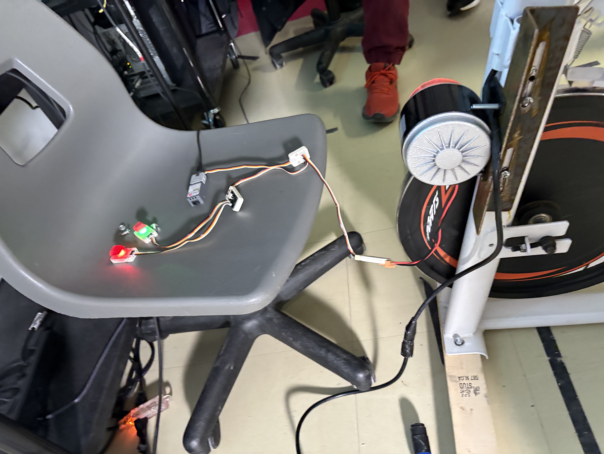

# Web-C0N-DU8

*Image provenant du GitHub de GearShift Games*

Diffusion complète de l'installation Web-C0N-DU8, une œuvre immersive réalisée par GearShift Games, 2025.

---

## Intérêts dans le multimédia
Je suis passionné(e) par les expériences numériques qui repoussent les limites de l’art interactif.  
Web-C0N-DU8 se distingue par l’innovation de son code et la simplicité de son design, qui transforment une interface web en un véritable terrain de jeu interactif.  
L'installation propose une narration digitale efficace qui incite chaque spectateur à repenser sa relation avec le numérique.

À découvrir ici :  
<https://gearshift-games.github.io/Web-C0N-DU8/#/>

---

## Ce qui me plaît dans l'expérience interactive
Ce que j'apprécie dans cette installation, c'est la rigueur de l'intégration entre l'activité physique et le multimédia.  
Le système de jeu de course, directement lié aux performances sur le vélo stationnaire, mesure la force appliquée, le nombre de tours effectués et la vitesse de pédalage.  
Cette approche offre un retour objectif sur l'effort fourni et transforme l'exercice en un défi interactif sérieux et engageant.

---

## Ressenti
Mon ressenti personnel est que cette installation est motivante et accessible.  
Elle me pousse à me dépasser grâce à une interface simple et efficace, et l'immersion numérique renforce l'engagement sans détourner l'attention de l'effort physique.

---

## Démarche d'utilisation de l'appareil
1. **Installation** : L'utilisateur s'installe sur le vélo stationnaire, l'interface principale.
2. **Activation** : En pédalant, les capteurs mesurent la force appliquée, le nombre de tours et la vitesse de pédalage.
3. **Transmission** : Ces données sont envoyées à l'ordinateur de contrôle, qui les convertit en informations pour le jeu.
4. **Projection** : Les informations sont projetées sur un grand écran, où le jeu de course évolue en temps réel selon la performance.
5. **Interaction** : L'utilisateur suit son score et ajuste son effort pour améliorer sa performance, transformant l'exercice en un défi interactif.

---

## Liste des composantes de l'installation
*(Explications simples et efficaces)*

- **Vélo Stationnaire**  
  Permet de convertir l'effort physique en données interactives.  
    
  *Image provenant du GitHub de GearShift Games*

- **Projecteur / Écran**  
  Affiche en temps réel le jeu de course et les visuels générés par l'interaction.  
    
  *Image provenant du GitHub de GearShift Games*

- **Schéma Filaire**  
  Montre comment les composants (capteurs, microcontrôleur, etc.) sont connectés pour transmettre les données.  
    
  *Photo prise par moi*

- **Enceintes Audio**  
  Diffusent le son synchronisé avec le jeu, renforçant l'immersion.

- **Capteurs**  
  Mesurent la force appliquée, le nombre de tours et la vitesse de pédalage pour alimenter le jeu en temps réel.

- **Carte de Prototypage**  
  Centralise et transmet les données des capteurs à l'ordinateur de contrôle.

- **Ordinateur de Contrôle**  
  Exécute le logiciel interactif qui orchestre l’ensemble du dispositif et met à jour le jeu de course en fonction de la performance.

---

