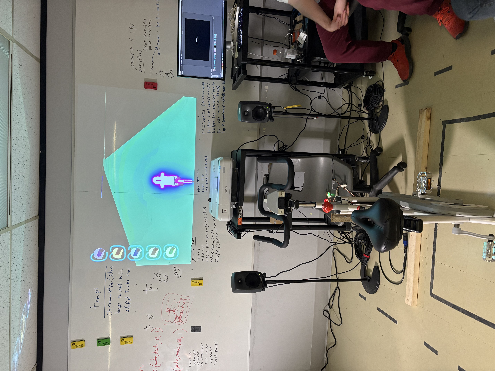

# Web-C0N-DU8

Diffusion complète de l'installation Web-C0N-DU8, une œuvre immersive réalisée par GearShift Games, 2025.

---

## Intérêts dans le multimédia
Je suis passionné(e) par les expériences numériques qui repoussent les limites de l’art interactif.  
Web-C0N-DU8 se distingue par l’innovation de son code et la créativité de son design, qui transforment une interface web en un véritable terrain de jeu sensoriel.  
L'installation propose une narration digitale surprenante qui incite chaque spectateur à repenser sa relation avec le numérique.

À découvrir ici :  
<https://gearshift-games.github.io/Web-C0N-DU8/#/>

---

## Galerie d'images

### 1. Diffusion complète de l’expérience

### 2. Vue d’ensemble de l’installation

### 3. Plan du jeu et du vélo

### 4. Plan de l’écran

### 5. Schéma filaire

---

## Ce qui me plaît dans l'expérience interactive de Web-C0N-DU8
Ce qui m'émerveille dans cette exposition, c'est la fusion entre le multimédia et l'activité physique.  
J'apprécie particulièrement que Web-C0N-DU8 combine le sport et l'interaction digitale.  
Le jeu intègre des courses et des scores à battre, ce qui encourage à se dépasser, tout en offrant une immersion numérique captivante.  
Chaque interaction révèle des aspects surprenants, alliant défi physique et expérience interactive stimulante.

> 💡 **Astuce** : Prenez le temps d'explorer chaque élément interactif – chaque clic et chaque mouvement enrichissent l'expérience et révèlent de nouvelles facettes de l'installation.

---

## Ressenti
J'ai trouvé l'expérience à la fois motivante et accessible.  
L'association de l'activité physique et du numérique transforme le pédalage en un jeu stimulant qui m'encourage à me dépasser tout en profitant d'une expérience interactive bien conçue et réfléchie.

---

## Liste des composantes de l'installation
*(Chaque composante est clairement identifiée et intégrée avec des images lorsque cela est pertinent, conformément aux critères de la grille d’évaluation.)*

- **Vélo Stationnaire**  
  *Interface principale* :  
  Le pédalage et la vitesse sont convertis en données, établissant un lien direct entre l'effort physique et l'environnement virtuel.  
  

- **Projecteur / Écran**  
  *Affichage interactif* :  
  Diffuse des visuels en temps réel qui réagissent aux interactions, transformant l'espace en une toile numérique dynamique.  
  

- **Schéma Filaire**  
  *Raccordements techniques* :  
  Illustrant comment les différents éléments (capteurs, LED, microcontrôleur) sont interconnectés pour assurer une synchronisation optimale.  
  

- **Enceintes Audio**  
  *Ambiance sonore* :  
  Diffusent une trame sonore synchronisée avec les interactions, renforçant l'immersion globale.

- **Capteurs (interrupteurs, capteurs de mouvement, etc.)**  
  *Collecte de données* :  
  Captent la vitesse, la pression et la rotation, transformant chaque geste en information exploitable pour enrichir l'expérience.

- **LED et Signaux Lumineux**  
  *Feedback visuel* :  
  Fournissent une rétroaction immédiate à l'utilisateur, indiquant l'état des interactions et ajoutant une dimension esthétique.

- **Carte de Prototypage (Arduino ou autre microcontrôleur)**  
  *Cerveau technique* :  
  Centralise et transmet les données des capteurs à l’ordinateur de contrôle pour orchestrer l'ensemble du dispositif.

- **Ordinateur de Contrôle**  
  *Cœur du système* :  
  Exécute le logiciel interactif qui gère la logique de l'installation et synchronise les données en temps réel.

---

*Cette présentation a été conçue en respectant les consignes d'une organisation rigoureuse, un nommage clair et une intégration soignée des images, conformément à la grille d’évaluation. Elle reflète mes idées et mon ressenti sur la fusion innovante entre le sport et le multimédia dans cette installation interactive.*

