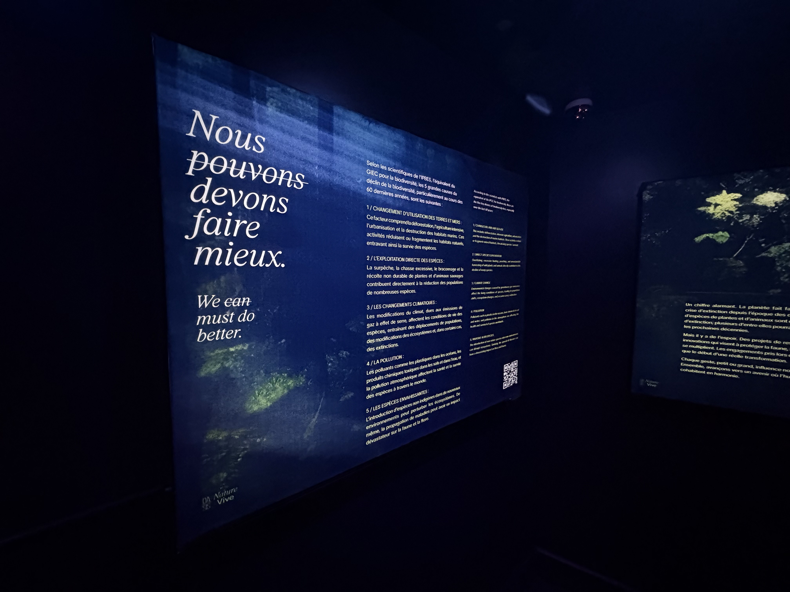
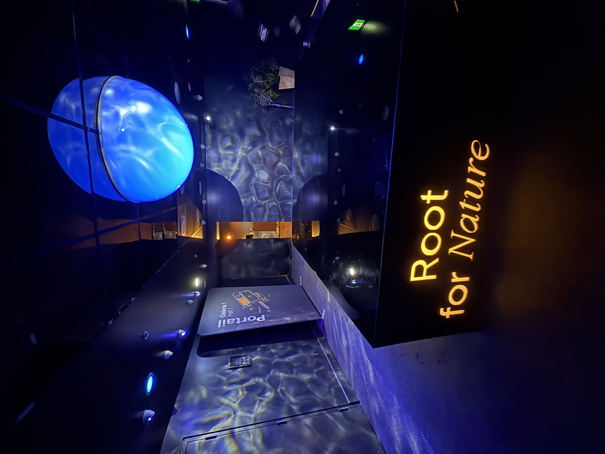
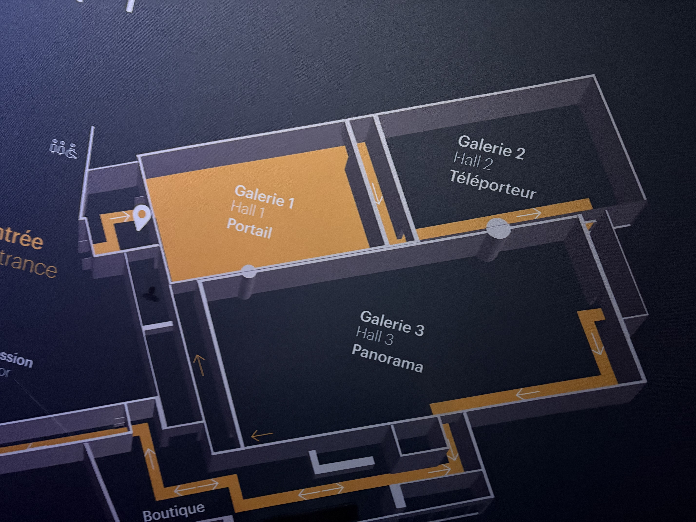
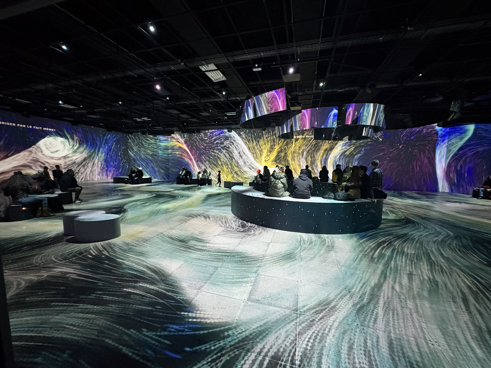
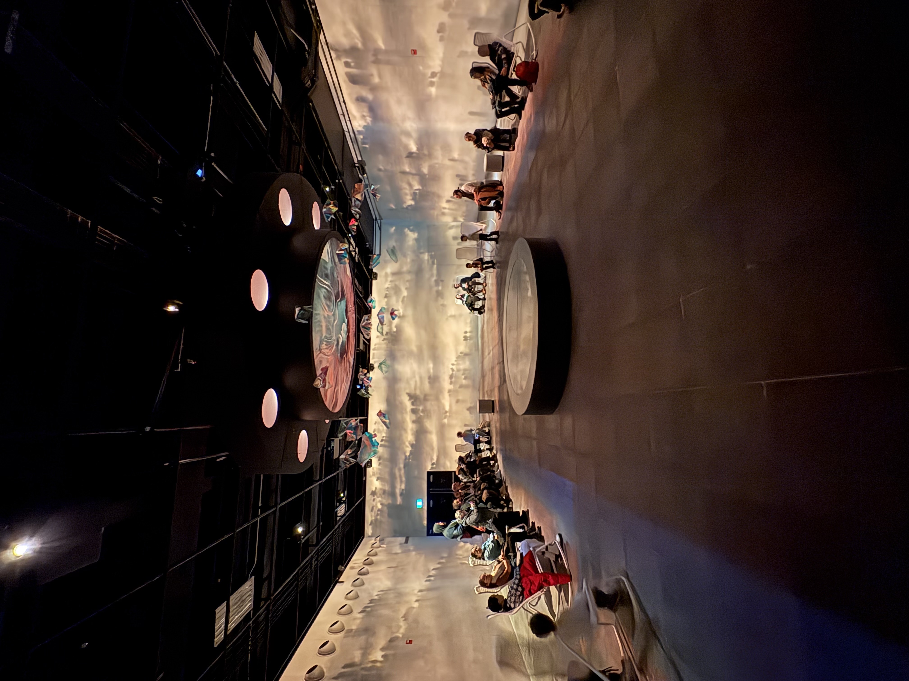
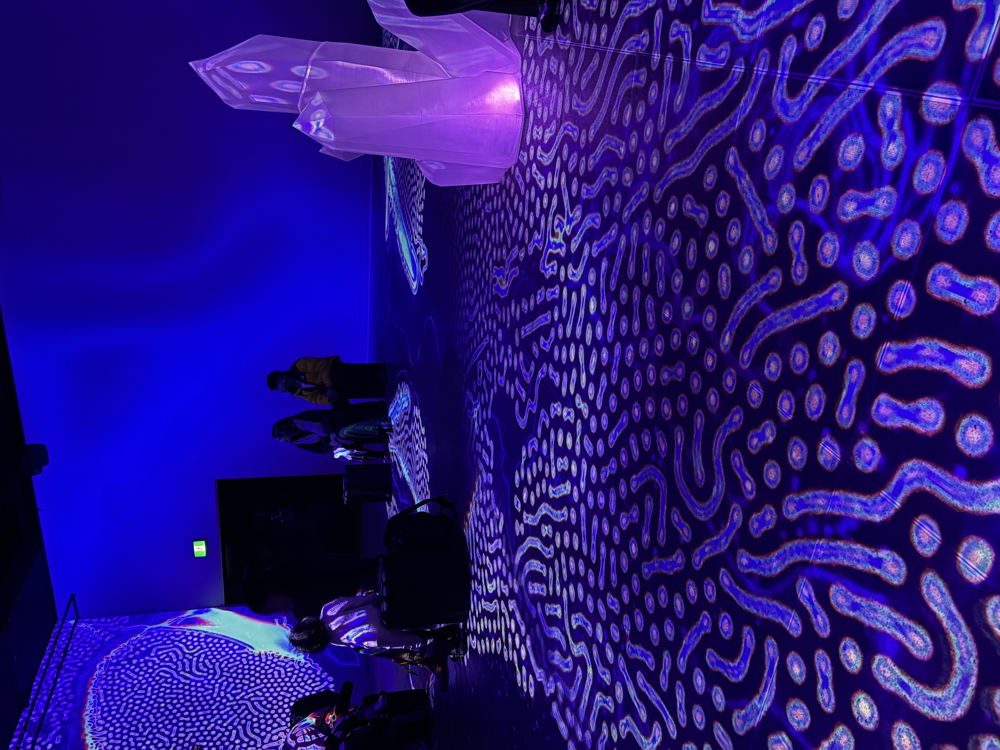
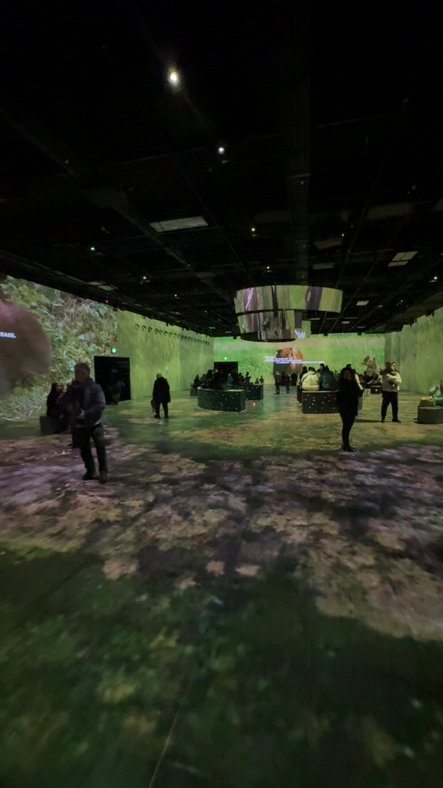
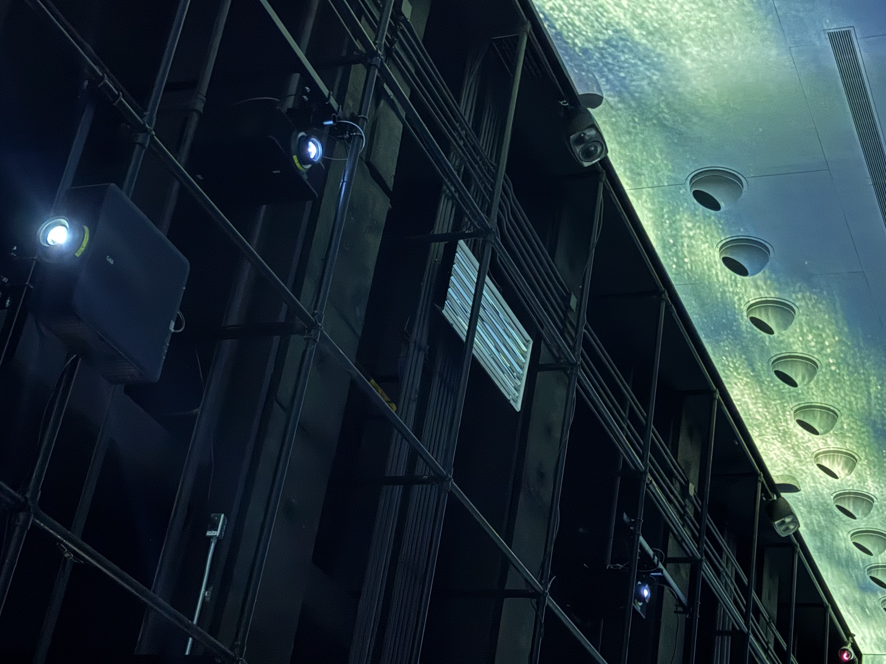
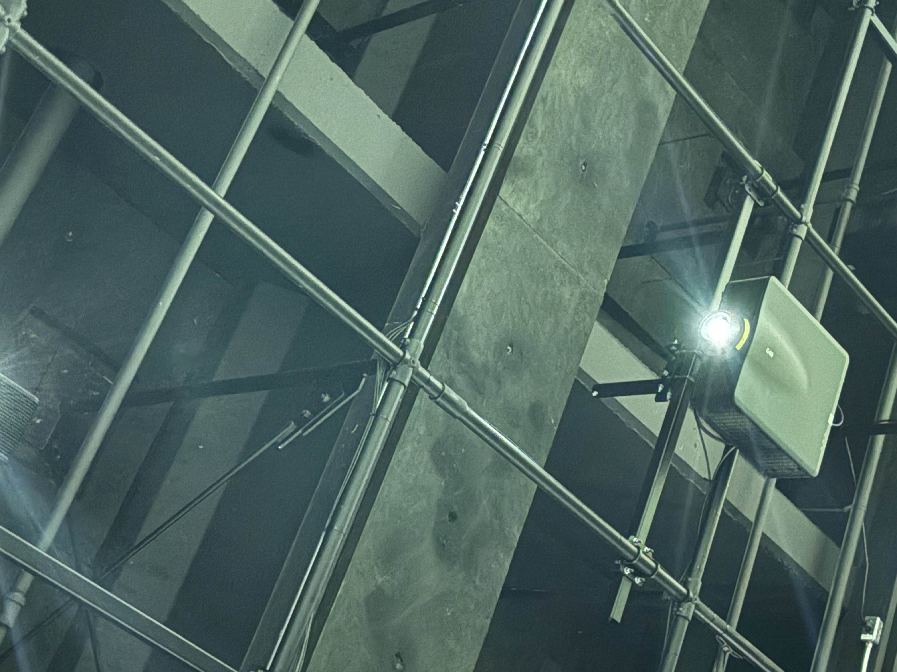

#Nature Vive

## Informations générales

**Nom de l’exposition ou de l’événement**  
Nature Vive – Root for Nature  
  
*Photo prise par moi*

**Lieu de mise en exposition**  
OASIS immersion – Palais des congrès de Montréal  
  
*Photo prise par moi*

**Plan de l’exposition**  
  
*Photo prise par moi*

## Type d’exposition  
Temporaire, immersive, intérieure

## Date de la visite  
30 avril 2025

---

## Oeuvre ou dispositif observé

**Titre**  
Galerie 3 – Panorama immersif  
  
*Photo prise par moi*

**Nom de l’artiste ou de la firme**  
OASIS immersion, en collaboration avec :
- National Geographic
- Fondation David Suzuki
- Organisation des Nations Unies (ONU)
- Age of Union

**Année de réalisation**  
2023–2024

---

## Description de l’œuvre ou du dispositif

Installation immersive projetée à 360 degrés sur les murs et le sol. Les séquences visuelles représentent des thèmes comme la biodiversité, la faune marine, les particules microscopiques. Le son spatialisé enveloppe le visiteur dans une ambiance contemplative et poétique.  
  
*Photo prise par moi*  
  
*Photo prise par moi*

---

## Type d’installation  
Immersive et contemplative

---

## Fonction du dispositif multimédia

- Mise en contexte environnementale  
- Sensibilisation à la biodiversité  
- Création d’un univers immersif sensoriel

---

## Mise en espace

La Galerie 3 est une salle rectangulaire d’environ 10 m x 20 m. Les projections couvrent l’entièreté des murs et du sol. Des bancs circulaires sont disposés au centre pour permettre au public de s’asseoir. Le plafond contient des projecteurs et haut-parleurs dissimulés dans une structure technique noire.  
  
*Photo prise par moi*

---

## Composantes et techniques utilisées

  
*Photo prise par moi*

- Projecteurs haute définition suspendus  
  
*Photo prise par moi*

- Haut-parleurs directionnels Genelec  
  
*Photo prise par moi*

- Éclairage d’ambiance au plafond  
.jpeg)  
*Photo prise par moi*

- Système de contrôle audio/vidéo synchronisé  
- Sol et murs comme surfaces de projection

---

## Éléments de mise en exposition

- Plafond technique avec grilles et rails  
- Systèmes de suspension et cache-fils  
- Bancs circulaires pour le public  
- Signalisation de cheminement lumineux  
  
*Photo prise par moi*

---

## Expérience vécue

L’ambiance était calme et contemplative. En marchant ou en m’asseyant, je me sentais absorbé dans une nature numérique. Le public était respectueux, souvent silencieux, et participait à une forme de méditation collective. L’absence d’interactivité renforçait le sentiment de pause, de déconnexion.

---

## Ce qui m’a plu, ce qui m’a donné des idées

La qualité visuelle et sonore m’a impressionné. Cela m’inspire à penser à un projet où la respiration ou les mouvements des visiteurs pourraient influer sur l’ambiance sonore et lumineuse, pour rendre l’expérience plus organique.

---

## Ce que je ne retiendrais pas ou que je ferais autrement

La durée de certaines boucles visuelles semblait un peu longue, ce qui peut réduire l’attention du visiteur. Pour mes propres créations, je favoriserais quelque chose de plus dynamique ou participative.
## Références

- Site officiel : https://oasis.im  
- Photos : prises par moi  
- Textes de l’exposition : panneaux d’information sur place

