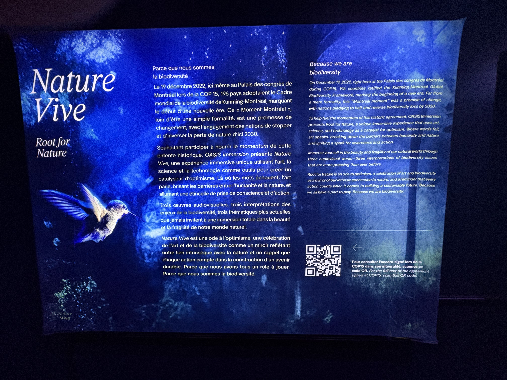
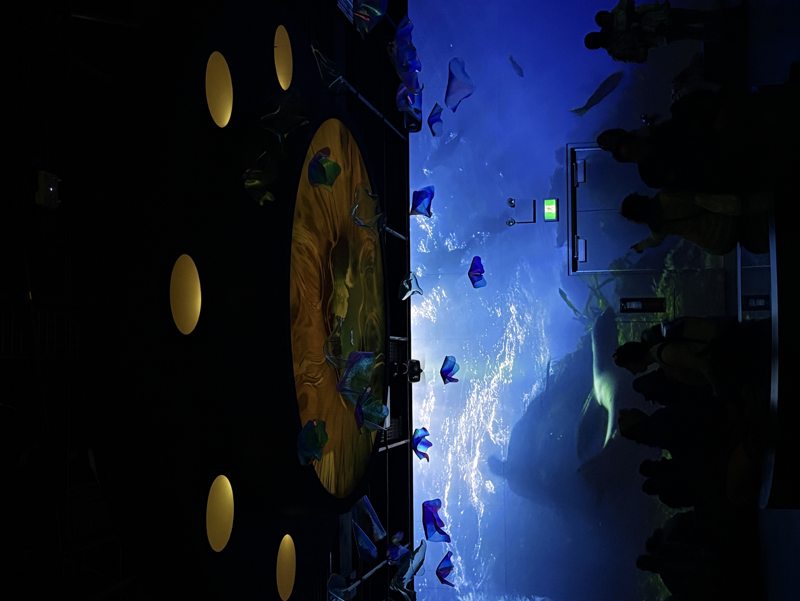

# Fiche d’inspiration – Nature Vive / Galerie 3

## Nom de l’exposition ou de l’événement
**Nature Vive – Root for Nature**  
  
*Photo prise par moi*

---

## Lieu de mise en exposition
**OASIS immersion – Palais des congrès de Montréal**  
  
*Photo prise par moi*

  
*Photo prise par moi*

---

## Type d’exposition
Temporaire, immersive, intérieure

---

## Date de la visite
30 avril 2025

---

## Titre de l’œuvre ou du dispositif
**Galerie 3 – Panorama immersif**  
  
*Photo prise par moi*

---

## Nom de l’artiste ou de la firme
OASIS immersion, en collaboration avec :  
- National Geographic  
- Fondation David Suzuki  
- ONU  
- Age of Union  
  
*Photo prise par moi*

---

## Année de réalisation
2023–2024

---

## Description de l’œuvre ou du dispositif
Installation immersive à 360° utilisant des projections synchronisées sur les murs et le sol. Les images représentent la biodiversité : océans, forêts, particules, etc. L’œuvre combine image, son spatial, lumière et narration environnementale.  
  
*Photo prise par moi*

---

## Type d’installation
Immersive et contemplative  
  
*Photo prise par moi*

---

## Fonction du dispositif multimédia
- Mise en contexte poétique  
- Sensibilisation à la biodiversité  
- Diffusion immersive du patrimoine naturel  
  
*Photo prise par moi*

---

## Mise en espace
Salle rectangulaire d’environ 10 m x 20 m. Projections sur murs et sol. Des bancs circulaires permettent au visiteur de s’asseoir librement. Le plafond est noir, rempli d’équipements suspendus.  
  
*Photo prise par moi*

  
*Photo prise par moi*

---

## Composantes et techniques utilisées
- Projecteurs HD  
- Haut-parleurs directionnels Genelec  
- Serveurs de synchronisation vidéo  
- Sol/murs comme surface de projection  
- Éclairage programmable  
  
*Photo prise par moi*

  
*Photo prise par moi*

---

## Éléments nécessaires à la mise en exposition
- Plafond technique à grilles  
- Suspension de projecteurs/enceintes  
- Câblage dissimulé  
- Bancs  
- Signalisation d’entrée  
.jpeg)  
*Photo prise par moi*

---

## Expérience vécue
Dès l’entrée, j’ai ressenti un fort contraste entre l’extérieur et l’intérieur de la salle. Le public restait calme, parfois immobile. J’ai déambulé lentement, absorbé par les projections, comme dans une bulle de nature numérique.

---

## Ce qui m’a plu, ce qui m’a donné des idées
L’harmonie entre visuel et audio m’a marqué. Cela m’a donné envie de créer une œuvre où le corps du visiteur influencerait directement les projections, pour créer un lien vivant et interactif avec le contenu.

---

## Ce que je ne souhaiterais pas retenir ou que je ferais autrement
Le contenu visuel est beau mais tourne en boucle. Une structure narrative ou interactive permettrait de relancer l’attention du visiteur. Pour mes projets, j’intègrerais une évolution visuelle ou sonore claire.

---

## Références
- https://oasis.im  
- Toutes les photos ont été prises par moi lors de la visite  
- Textes issus des panneaux : `nature_vive_detail.jpeg`, `detail_oeuvre.jpeg`

