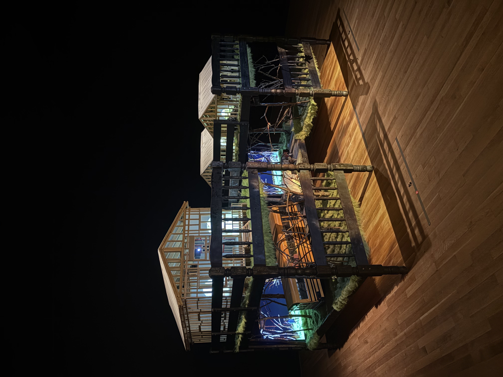
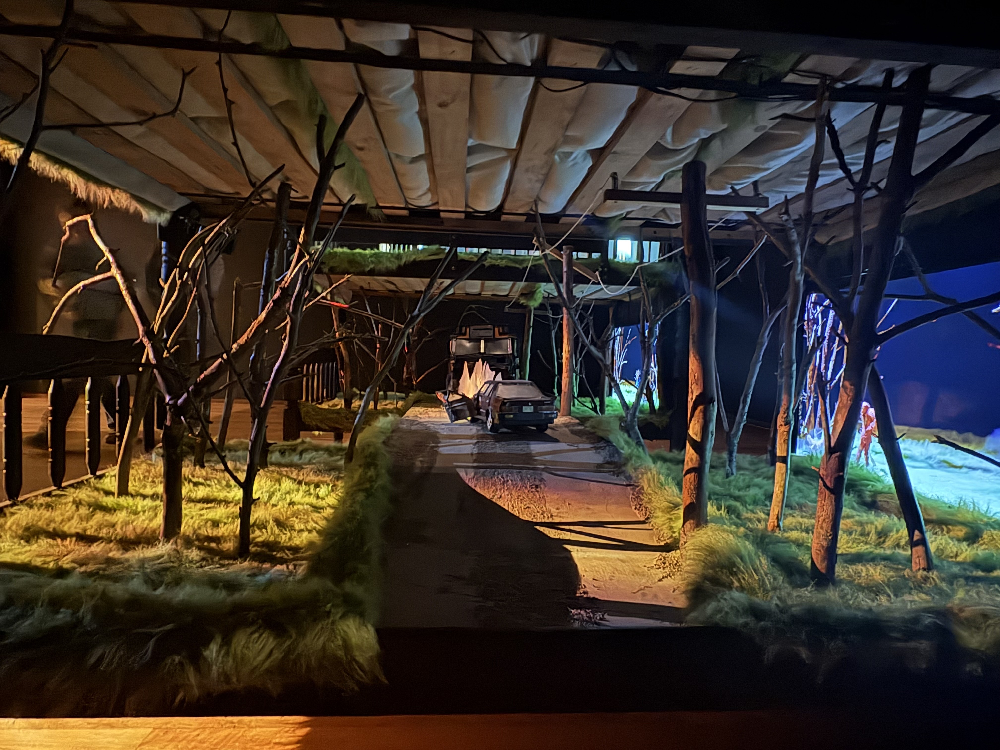
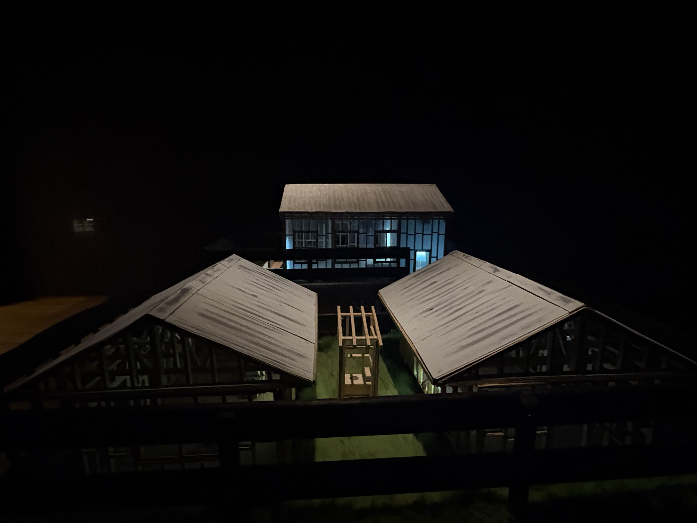
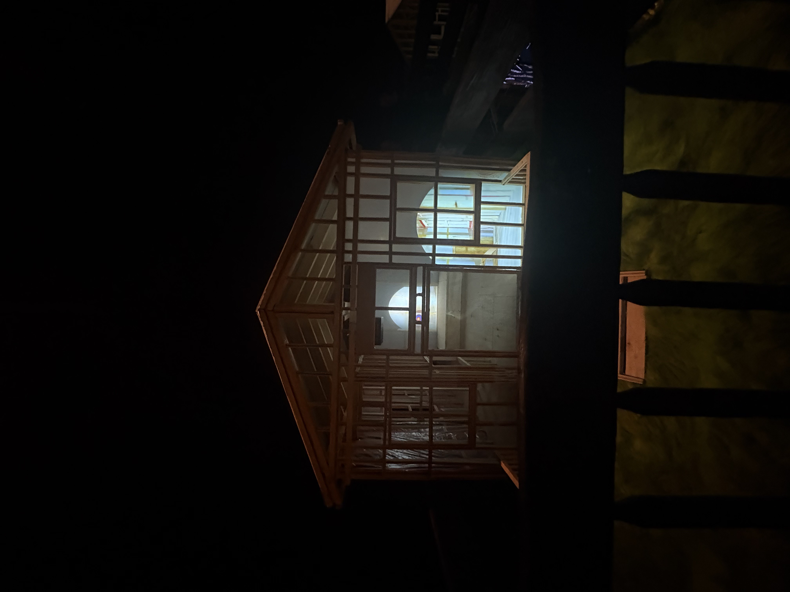
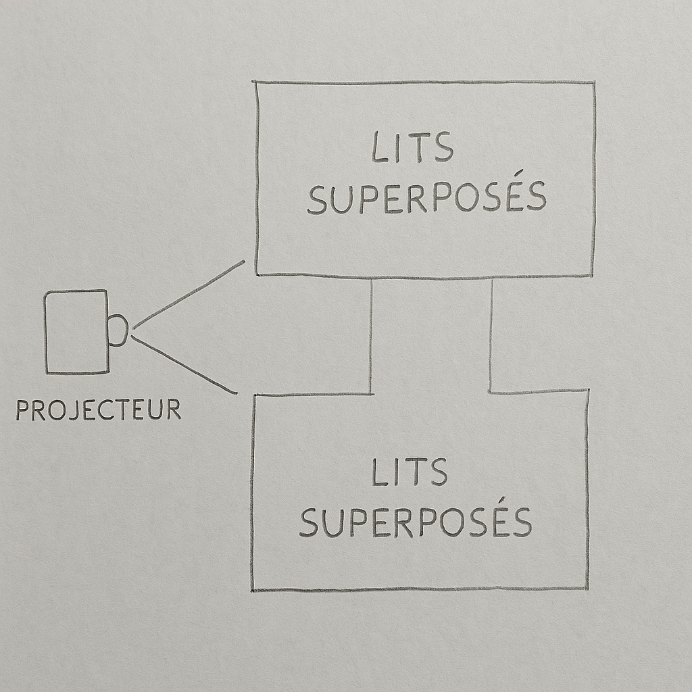
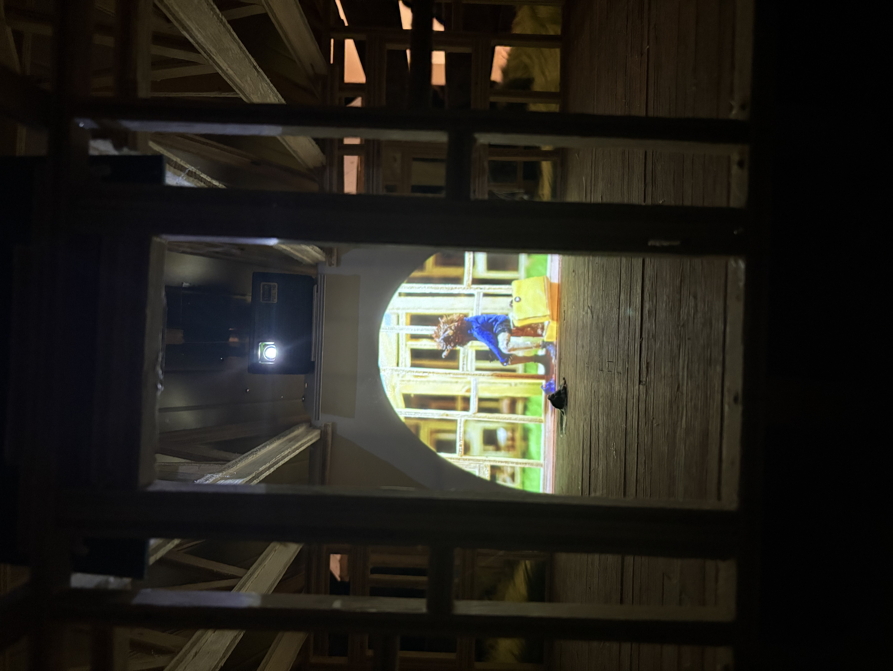
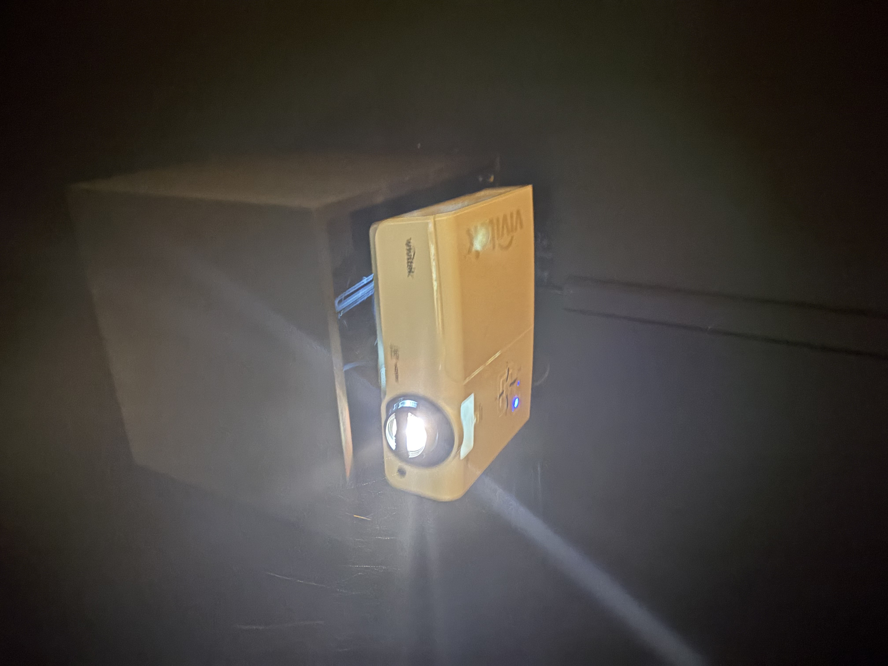
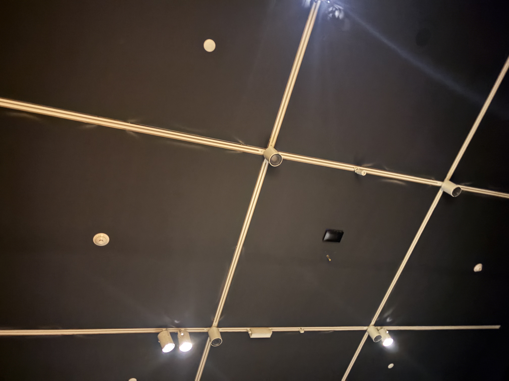
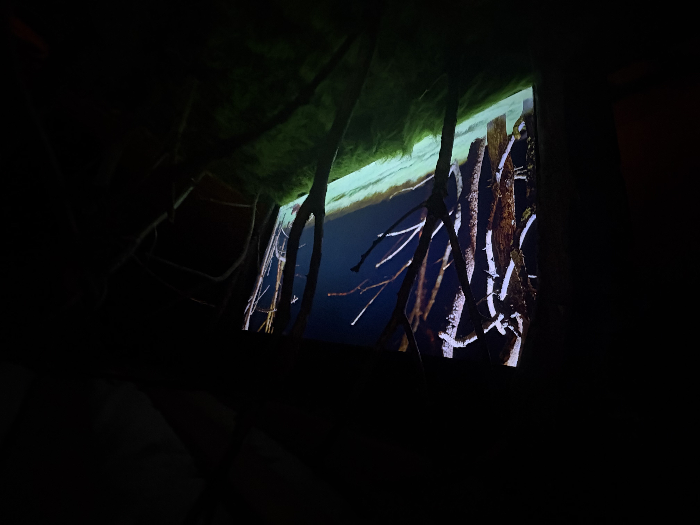
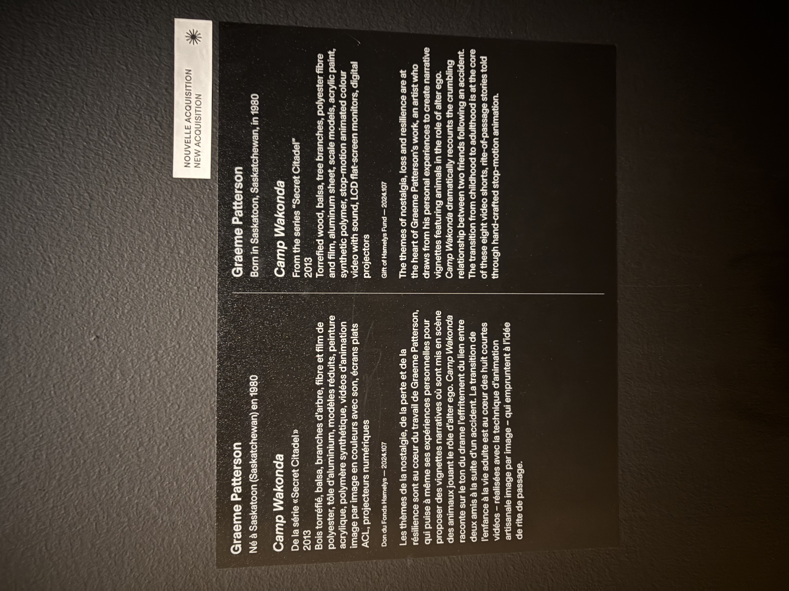

# Travail 5

## Informations générales

- **Nom de l'exposition :** Secret Citadel  
- **Lieu de mise en exposition :** Musée des beaux-arts de Montréal  
- **Type d'exposition :** Nouvelle acquisition, exposition intérieure  
- **Date de la visite :** 3 avril 2025

---

## Œuvre choisie

- **Titre de l'œuvre :** Camp Wakonda  
- **Nom de l'artiste :** Graeme Patterson  
- **Année de réalisation :** 2013

### Description de l'œuvre

*Camp Wakonda* est une installation immersive composée de maquettes miniatures en bois, de matériaux naturels, de vidéos projetées en stop-motion et d’un dispositif scénographique évoquant un camp d’été. L’œuvre traite de la mémoire, de l’amitié et de la nostalgie à travers huit courts-métrages projetés dans des cabanes miniatures.

  
*Vue d'ensemble de l'installation Camp Wakonda — photo prise par moi*

---

## Type d'installation

- **Type :** Immersive et contemplative  
- **Interaction :** Le visiteur se déplace librement autour de l’installation et observe les courts-métrages à travers les ouvertures de cabanes miniatures.
---

## Mise en espace

L’installation est montée sur deux lits superposés en bois, placés au centre d’une pièce sombre. À l’intérieur des structures se trouvent des cabanes miniatures projetant les vidéos. L’éclairage ciblé et les projecteurs suspendus créent une ambiance unique.

  
*Point de vue depuis l’intérieur d’une structure — photo prise par moi*

  
*Vue de haut des maquettes — photo prise par moi*

  
* Structure de la cabane — photo prise par moi*

  
*Croquis des lits superposés et du projecteur — photo prise par moi*

---

## Composantes et techniques

- **Matériaux :** Bois torréfié, balsa, branches naturelles, fibre, polyester, tôle d’aluminium, peinture acrylique, polymère synthétique  
- **Techniques :** Maquettisme, animation image par image (stop motion), vidéo projetée  
- **Technologies :**  
  - Écrans   
  - Mini-projecteurs numériques  
  - Haut-parleurs
  - Projecteur principal
  
*Mini projecteur numérique utilisé dans l’œuvre — photo prise par moi*

  
*Projecteur principal suspendu au plafond — photo prise par moi*

---

## Éléments nécessaires à la mise en exposition

- Deux lits superposés comme support de la structure  
- Mini-projecteurs et écrans intégrés  
- Éclairage suspendu et dirigé  
- Cloisons noires pour isoler la salle  
- Fils et câbles dissimulés  
- Bande de sécurité au sol

  
*Disposition des lumières au plafond — photo prise par moi*

  
*positionnement des écrans  — photo prise par moi*

---

## Cartel

  
*Cartel de présentation de l’œuvre — photo prise par moi*

---

## Expérience vécue

On marche autour de l’œuvre, on se penche pour observer les écrans à l’intérieur des maquettes. Le dispositif évoque des souvenirs d’enfance, rendant l’expérience à la fois nostalgique.

  
*Expérience du visiteur : observation rapprochée des vidéos à l’intérieur des cabanes — photo prise par moi*

---

## Appréciation personnelle

Ce qui m’a le plus touché dans *Camp Wakonda*, c’est l’utilisation de maquettes miniatures pour raconter une histoire aussi émotive et personnelle. L’effet de “regarder dans un souvenir” est saisissant. La précision artisanale combinée à la technologie donne une œuvre à la fois tactile et numérique.  
Cela m’inspire beaucoup pour mes propres projets multimédias, en me donnant envie de combiner sculpture et vidéo.

---

## Sources et références

- Cartel officiel de l’exposition (photo prise sur place)  
- Observation directe et documentation visuelle personnelle  
- Fichier : `H25_TIM_TP5_banque_inspirations_grille_evaluation.pdf`

---

_Fiche réalisée dans le cadre du cours Œuvres et dispositifs multimédias en exposition (570V11MO), session Hiver 2025, Collège Montmorency._

